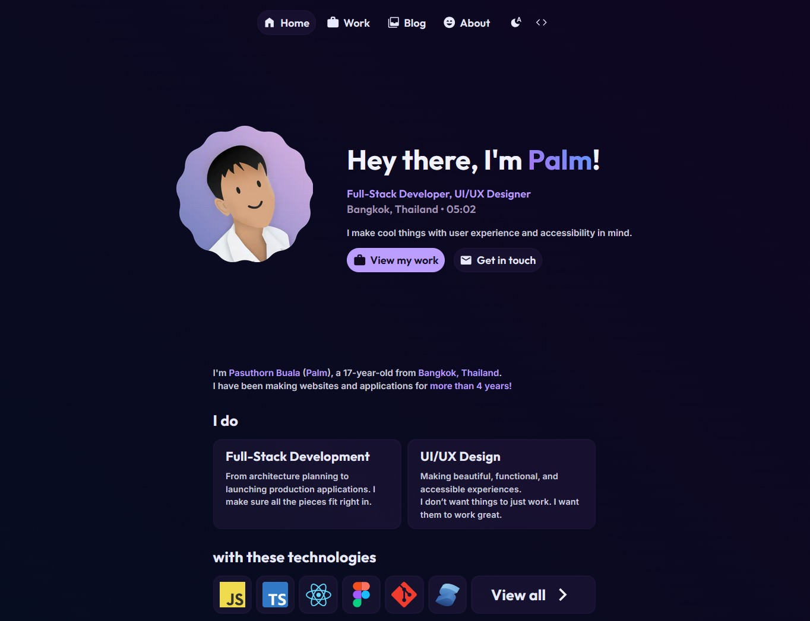

# 🌐 Website

My personal and portfolio website, built with [Astro](https://astro.build/) and [SolidJS](https://www.solidjs.com/).

[📎 Live site](https://v2.palmdevs.me)  
[🖌️ Figma design](https://www.figma.com/design/scwi73muUFOAd6T02DaHo1/Website-Redesign)



## 🧰 Stack

- [Astro](https://astro.build/)
- [SolidJS](https://www.solidjs.com/)
- [Bun](https://bun.sh/)

## 👷 Developing

> [!NOTE]  
> Since Bun isn't fully compatible with Node.js yet, you should probably install Node.js alongside Bun to avoid potential issues with Astro.  
> Bun will automatically use the installed Node.js for running Astro, so you don't have to worry about it.

1. Install dependencies

   ```sh
   bun install
   ```

2. Start the development server

   ```sh
   bun run dev
   ```

### ⚒️ Building

1. Build the site

   ```sh
   bun run build
   ```

2. Preview the built site

   ```sh
   bun run preview
   ```

### 🐳 Deployment

Currently, the site is deployed on Cloudflare Pages. If you want to deploy it on other services, you can change the adapter in `astro.config.mjs`:

```diff
     },
-    adapter: cloudflare({
-        ...
-    }),
+    // Add your adapter here
```

## 📝 License

This project is licensed under the GNU General Public License v3.0. See the [LICENSE](./LICENSE) file for details.  
While the work itself is open source, I'd appreciate if you would credit me as the author if you'd like to use this project for your own work. Thank you! 💖
