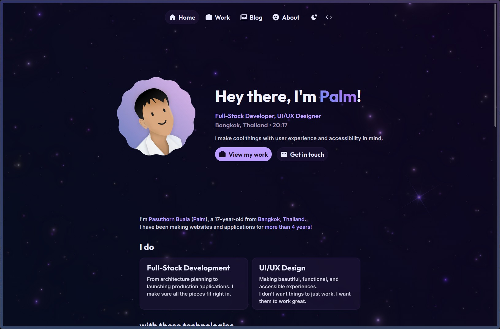

# 🌐 Website

My personal and portfolio website, built with [Astro](https://astro.build/) and [SolidJS](https://www.solidjs.com/).

[📎 Live site](https://v2.palmdevs.me)  
[🖌️ Figma design](https://www.figma.com/design/scwi73muUFOAd6T02DaHo1/Website-Redesign)



## 🧰 Stack

- [Astro](https://astro.build/)
- [SolidJS](https://www.solidjs.com/)
- [Bun](https://bun.sh/)

## 👷 Developing

1. Install dependencies

   ```sh
   bun install
   ```

2. Start the development server

   ```sh
   bun run dev
   ```

### ⚒️ Building

1. Build the site

   ```sh
   bun run build
   ```

2. Preview the built site

   ```sh
   bun run preview
   ```

### 🐳 Deployment

This site can be deployed to a Docker container.
The port is exposed on `8443`.

```sh
# Run on this shell
docker compose up
# or run in background
docker compose up -d
```

If you want to deploy statically via GitHub pages, Cloudflare pages, or similar, modify [astro.config.mjs](./astro.config.mjs) to remove the adapter for Node.js:

```diff
     },
-    adapter: node({
-        mode: 'middleware',
-    }),
     // ...
```

The `dist/` directory can then be served statically.

## 📝 License

This project is licensed under the GNU General Public License v3.0. See the [LICENSE](./LICENSE) file for details.  
While the work itself is open source, I'd appreciate if you would credit me as the author if you'd like to use this project for your own work. Thank you! 💖
